# Detecting-License-Plates-using-EasyOCR-and-Pytesseract

[Introduction](#Introduction)

[My Second Title](#markdown-header-my-second-title)

# Introduction

With the rapid development of number plate detection technology, or Automatic License Plate Recognition (ALPR), its widespread use in Intelligent Transportation Systems (ITS) has made significant progress. Technology such as this has been used widely in services such as suspected vehicle tracking, traffic management, and many other fields. Due to people's changing needs, new modern technologies like that are emerging and increasing, so it has become necessary to improve license plate detection and recognition algorithms to increase vehicle management efficiency. 

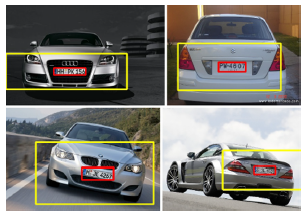 

Almost every day, news reports circulated that a vehicle was stolen from a parking lot or some other place in the city, or had been involved in an accident and fled. In order to identify these vehicles, authorities should install license plate detection and recognition devices on CCTV cameras at every street corner throughout the region. The system enables police to track prohibited activities involving vehicles.  Vehicle license plate (VLP) recognition is now an essential component of any ITS such as security control of restricted areas, traffic law enforcement, and automatic payments of tolls on highways. Since license plate localization is the first and foremost step of the recognition process, the outcome has a direct impact on the accuracy of character segmentation and recognition. While the number plate can be easily affected by factors such as weather and lighting conditions; as well as most VPLR systems do not consider background and illumination conditions, locating and detecting the license plate from original images with accuracy is vital.

# Methodology

The proposed methodology uses OpenCV (Open-Source
Computer Vision Library) for performing all basic image processing
techniques. This open-source library provides a wide
range of functions related to computer vision and artificial
intelligence. In order to accelerate commercial use of machine
perception, OpenCV aims to provide a common infrastructure
for computer vision applications. As an open-source product,
OpenCV is easy to use and modify by companies.

 

It contains more than 2500 algorithms including both classic
and cutting-edge computer vision and machine learning
algorithms. They are capable of detecting and recognizing
faces, identifying objects, classifying human actions in videos,
tracking camera movements, tracking moving objects, creating
3D models of objects from stereo cameras, and stitching
images together to create a high-resolution picture of an entire
scene. [

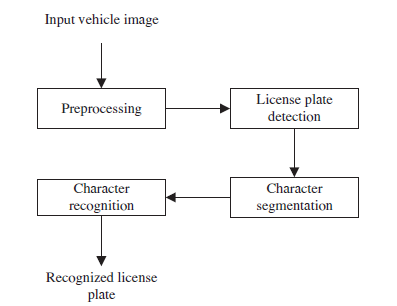 

# Image-Preprocessing
The actions taken to format images before they are utilised
in model training and inference are known as image preprocessing.
These covers resizing, orienting, and colour corrections,
among other things. To prepare image data for
model input, preprocessing is required. For example, convolutional
neural networks require images with the same size
arrays for fully connected layers.

 
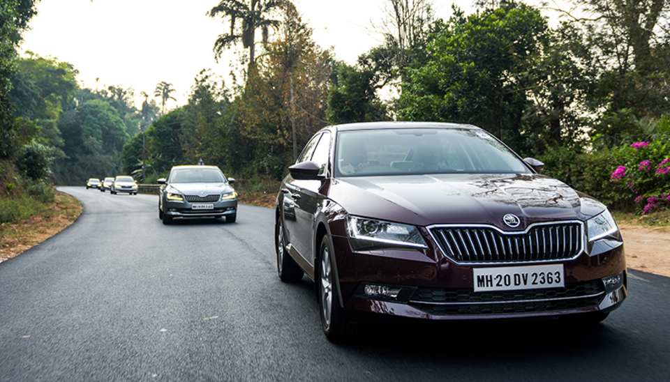 

The term ”image pre-processing” refers to operations on
images on the smallest scales. If entropy is a measure of
information, then these operations do not increase image information
content but decrease it. In preprocessing, distortions
or other unwanted details are suppressed or enhanced during
the data collection phase or as part of the analysis process.

## Convert to Grayscale 

Greyscale (or graylevel) images have only grayscale colors.
In contrast to any other type of color image, such images
require less information for each pixel. Rather than specifying
three intensities for each pixel in a full color image, each pixel
in a ’gray’ color has the same red, green and blue components. For this reason, a gray color only requires one intensity
value.

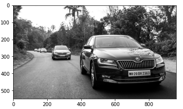

## Bilateral filter and Canny Edge Detection

cv.bilateralFilter() effectively removes
noise while keeping edges sharp. Bilateral filtering also uses a Gaussian filter, but it uses
a different Gaussian filter based on the difference in pixels.
With a Gaussian function of space, the blurring can only affect
pixels that are in the same vicinity, while a Gaussian function
of intensity makes sure that only pixels with the same intensity
as the central pixel are blurred. Since pixels along the
edges will have a large variation in intensity, it preserves the
edges.

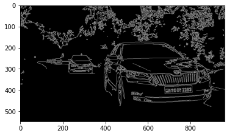 

Edge detection methods like
Canny Edge Detection are among the most popular ones on the
market since they are so robust and flexible. The method uses a
three-stage process to recognize edges in images. Additionally,
the image must be blurred. This is a necessary step
in the preprocessing process to reduce noise.

# Image Detection

## Contours
In simple terms, a contour is a curve that joins
all continuous points (along the boundary), sharing the same
color or intensity. For shape analysis as well as for detecting
and recognising objects, contours are useful.

Upon calls to findContours(), OpenCV 3.2 returns a modified
image instead of the original image source. Finding
contours in OpenCV is like finding a white object against a
black background. Therefore, the object to be found should be
white and the background should be black. Cv.findContours()
takes three arguments: an image source, a contour retrieval
mode, and a contour approximation method.

In order to display the contours, the cv.drawContours function
is used. Likewise, it can be used to draw any shape,
provided that its boundary points are known. The first
argument is the source image, the second argument is the
contours, which is a Python list, the third argument is the
contour index, and the last argument is color.

## Masking

A mask is used to protect a specific portion
of an image, just as you would use a tape to cover your house
when you’re painting it. By masking an area of an image, that
area is protected from being altered by any changes made to
the rest of the image. In this method, we define a small ’image
piece’ and then use it to modify a larger image. Masking
underlies many types of image processing, including edge
detection, motion detection, and noise reduction.

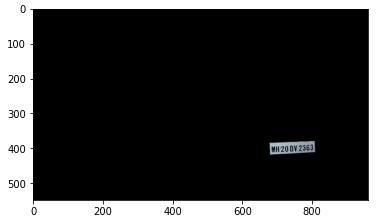 

# Character Recognition

The optical character reader or optical character recognition
(OCR) converts the text in visuals to machine-readable text.
It could be a printed document (invoice, bank statement,
restaurant bill), a placard (sign-board, traffic symbol), even
handwritten text. It could be useful for converting these
visuals to text to extract information, scan books and make
PDFs, store them in system or use it online for text to speech
(to help visually impaired people), used extensively in autonomous
vehicles. In this era of technological advancement,
optical character recognition is being enhanced for improved
accuracy in performance.

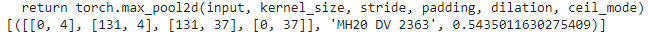 

## Grayscale Image and Medium Blurring

In the function cv.medianBlur(), the central element is
replaced with the median value of all pixels under the kernel.
This technique is highly effective in preventing sharp and
sudden image disturbances. For other methods, the central
component is a new calculation, which could be a pixel value
in the image or something entirely original. Median
blurring, on the other hand, always replaces a central element
with some pixel value on the image. It effectively reduces
noise. Additionally, its kernel size should be an odd positive
number.

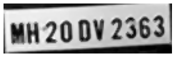 

# Results

Some great results were obtained after performing all the
discussed methodologies.A detailed analysis of the outcome
is discussed in this is section.

## Deteted License Plate

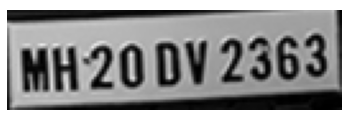 

Observe the highlighted green rectangle in Figure 13 to
see the detected license plate. Among the techniques used to accurately detect visible number plates were contour detection,
approxPolyDP(), and image masking.

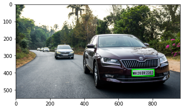 

## License Plate Character Recognition

The EasyOCR package in Python
converts an image into text. With access to 70+ languages
such as English, Chinese, Japanese, Korean, Hindi, and many
more are added daily, it is by far the easiest way to use OCR. The EasyOCR software was developed by the Jaided AI
company.

Pytesseract or Python-tesseract is a
tool for performing optical character recognition (OCR) in
Python. Thus, it will be able to recognize and interpret text
that is embedded in images. Essentially, it wraps Google’s
Tesseract-OCR Engine. The script can also be invoked separately
by directly accessing the TESSERACT module. It
supports the entire range of image formats supported by the
Pillow and Leptonica libraries, including JPEG, PNG, GIF,
BMP, TIFF, and more. The added bonus of Pytesseract is
that it can simply print the recognized text instead of writing
it to a file. As part of the project, I chose this one since
it is completely open-source and is being developed and
maintained by Google.

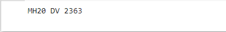 

Pytesseract performed an extremely accurate
identification of the detected license plate. The Pytesseract
library requires a few pre-processing operations before it can
be used, such as grayscale image transformation and medium
blur.

